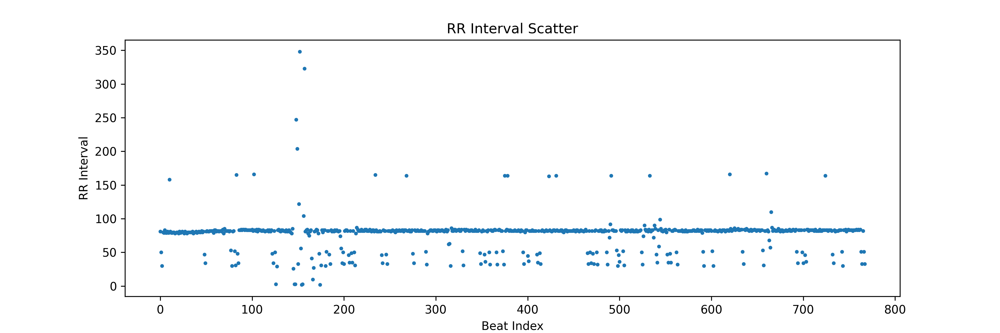
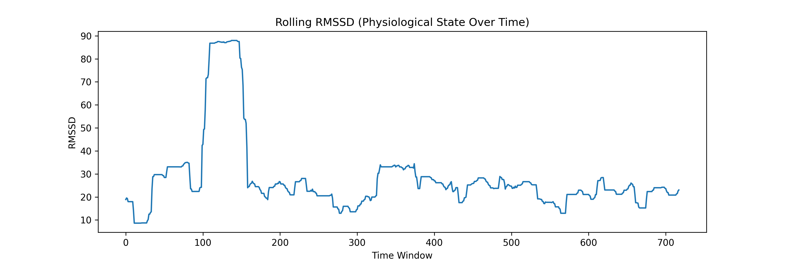
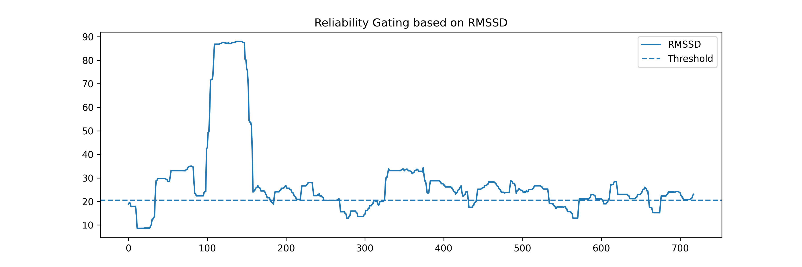

# DMSI – Delayed Metabolic State Inference

A research prototype exploring reliability-aware physiological inference for non-invasive metabolic monitoring.
⚠️ This repository presents a conceptual research prototype rather than a production-ready system.

---

## Overview

This project explores a conceptual framework for metabolic sensing systems that explicitly account for physiological reliability and temporal delay.

Many non-invasive metabolic sensing approaches assume that biomarkers (such as breath VOCs) directly reflect instantaneous blood glucose levels. However, physiological processes often introduce temporal delays and contextual variability. The DMSI framework explicitly models the biomarker-glucose relationship as a non-stationary mapping that varies across physiological regimes. A key goal is to explore whether physiological signals (e.g., from PPG) can be used to detect these regime shifts, identifying moments where the state-dependent mapping becomes invalid.

The DMSI framework investigates two key ideas:

1. Physiological signals can indicate when metabolic inference is reliable.
2. Biomarkers such as VOCs may represent delayed metabolic state rather than instantaneous glucose levels.

This repository provides a prototype implementation of the physiological reliability layer within the DMSI framework.

## Conceptual Positioning

Unlike conventional approaches that optimize prediction accuracy, this project reframes metabolic sensing as a problem of inference validity under physiological modulation.
Instead of assuming a stable mapping between biomarkers and glucose, the DMSI framework investigates when such mappings are physiologically valid, and when they break down due to systemic perturbations.

## DMSI Framework

The DMSI framework models metabolic sensing as a three-layer process:

**Layer 1 — Physiological State**

Signals reflecting autonomic and cardiovascular dynamics  
(e.g., PPG, HRV)

↓

**Layer 2 — Reliability Filtering**

Detection of physiological conditions where metabolic inference may be unreliable  
(e.g., stress, motion, autonomic imbalance)

↓

**Layer 3 — Delayed Metabolic Signals**

Biomarkers such as breath VOCs that may reflect metabolic state with temporal delay


This project focuses on **Layer 1 and Layer 2**, providing a prototype for physiological reliability assessment.

---
## Prototype Implementation

This repository contains an early research prototype implementing the first stage of the DMSI framework.

The current implementation focuses on extracting physiological features from PPG signals and visualizing HRV characteristics that may reflect autonomic nervous system states.

## Prototype Goal

The prototype's goal is to explore inference validity rather than raw prediction accuracy. It focuses on identifying conditions under which physiological signals (like HRV) become decoupled from metabolic targets (like glucose), thus invalidating the mapping between them. 

Instead of assuming continuous reliability, the framework introduces **context-aware inference validity assessment.**

---

## Data Sources

Public physiological datasets containing PPG or cardiovascular signals may be used, including:

- PhysioNet datasets
- wearable sensor datasets containing PPG
- stress or activity monitoring datasets

These datasets provide physiological signals suitable for HRV extraction and reliability modeling.

---

## Methods

The prototype pipeline consists of:

1. PPG signal preprocessing
2. HRV feature extraction
3. Physiological state classification
4. Reliability-aware inference filtering

Example HRV features include:

- RMSSD
- SDNN
- mean heart rate
- inter-beat interval variability

Simple baseline models such as logistic regression or tree-based classifiers can be used for proof-of-concept.

---

## Repository Structure

```
DMSI
│
├── Data
│   Subset of physiological data used for demonstration
│
├── notebooks
│   HRV signal processing and visualization notebooks
│
├── SRC
│   Signal processing utilities and future modules
│
├── figures
│   Generated visualization results
│
└── README.md
```

## Research Direction

Future extensions of this framework include:

- Latent State Modeling: Extending the framework toward a latent state model, where both physiological signals (PPG/HRV) and biomarkers (VOCs) are treated as indirect, noisy observations of the underlying metabolic dynamics.
- Integrating inference validity with metabolic prediction models.
- Exploring uncertainty-aware inference in digital health systems.

---
## Current Prototype Status

The current repository implements a basic HRV signal processing pipeline including:

- PPG signal visualization
- peak detection
- RR interval extraction
- HRV feature visualization (SDNN, RMSSD)
- exploratory physiological state analysis

This stage focuses on validating the feasibility of physiological reliability indicators before integrating delayed metabolic biomarkers such as breath VOC signals.
## Example Visualization
All generated figures are stored in the `figures/` directory.

### RR Interval Analysis

Example RR interval series extracted from PPG signals:



### HRV Dynamics (Physiological State)

Time-varying RMSSD illustrates how autonomic state evolves over time:



### Inference Validity Gating

A simple prototype demonstrating how physiological signals can be used to identify potentially unreliable inference regions:



## Author

Ke Shang

Research interests: digital health, physiological signal inference, reliability-aware modeling, computational physiology
